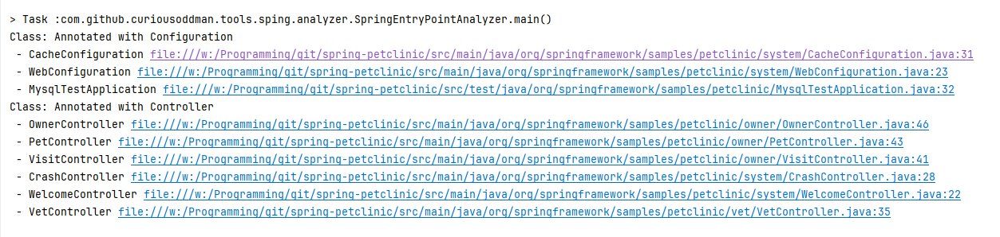

# Maven plugin to anlyzes unknown Spring Boot application

## Motivation

When you face a new Spring Boot application code - you might struggle finding all the "entry points" of an application.

There are various annotations and interfaces that will trigger code execution withing a Spring Boot application.

This plugin scans all source files and attempts to find them all and list grouped result.

## Disclaimer

This plugin is not a mature product. Use with caution, report issues, feel free to contribute.

## What exactly is looked for?

All classes that implement interfaces:
```
            "org.springframework.boot.ApplicationRunner",
            "org.springframework.boot.CommandLineRunner",
            "org.springframework.beans.factory.InitializingBean",
            "org.springframework.beans.factory.Disposableßean",
            "org.springframework.context.SmartLifecycle"
```

All classes/methods annotated with, or classes/methods annotated with annotations annotated with:
```
            "org.springframework.stereotype.Controller",
            "org.springframework.context.annotation.Configuration",
            "jakarta.annotation.PostConstruct",
            "jakarta.annotation.PreDestroy",
            "org.springframework.scheduling.annotation.Scheduled",
            "org.springframework.context.event.EventListener"
```

## How to run:

1. Currently plugin is not published to public repository, therefore it needs to be built locally
      1. Clone the repo
      2. Run `mvn clean install`
2. Run plugin in your project
      1. `mvn com.github.curiousoddman.tools.spring.boot.analyzer:spring-boot-entry-point-scanner-plugin:scan`
      2. If necessary, add additional interfaces or annotations to look for:
            1. `-Dspring-boot-scanner.interfaces=<your-interface-fqdn>`
            2. `-Dspring-boot-scanner.annotations=<your-annotation-fqdn>`


## Example output:

For example, if I run this app on https://github.com/spring-projects/spring-petclinic project, I see following output:




